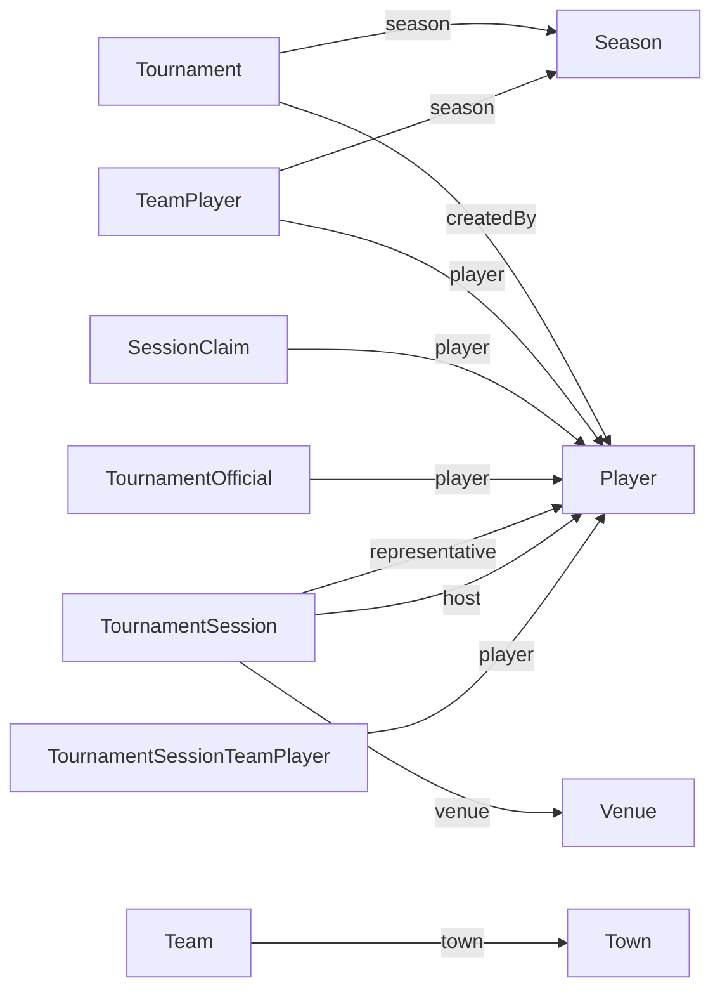

# Дизайн: Steering-файл карти Doctrine-сутностей

## Overview

Steering-файл `.kiro/steering/entities.md` — це структурований markdown-довідник, який описує всі 20 Doctrine-сутностей проєкту. Файл автоматично включається в контекст Kiro (бо не має front-matter) і забезпечує розуміння доменної моделі без необхідності відкривати окремі Entity-файли.

Ключові проєктні рішення:
- **Markdown-таблиці** для компактного представлення полів та зв'язків
- **Групування за модулями** (Common → Classic) відповідно до архітектури проєкту
- **Мінімалістичний формат** — лише ті дані, які потрібні для прийняття рішень під час розробки
- **Бюджет контексту** — файл має бути достатньо компактним (~4–6 KB), щоб не перевантажувати контекстне вікно Kiro

## Architecture

Файл не має програмної архітектури — це статичний markdown-документ. Структура організована ієрархічно:

```
H1: Заголовок файлу
├── H2: Common (модуль)
│   ├── H3: Country
│   ├── H3: Player
│   └── ...
└── H2: Classic (модуль)
    ├── H3: Appeal
    ├── H3: SessionClaim
    └── ...
```

Сутності всередині кожного модуля розташовані в алфавітному порядку.

## Components and Interfaces

### Шаблон опису сутності

Кожна сутність описується за єдиним шаблоном:

```markdown
### EntityName

Короткий опис призначення (1–2 речення українською).

**Файл:** `src/{Module}/Entity/{EntityName}.php`
**Таблиця:** `custom_table_name` ← лише якщо відрізняється від конвенції Doctrine

#### Поля

| Поле | Тип | Nullable | Примітка |
|------|-----|----------|----------|
| id | int | — | PK, auto |
| name | string(255) | — | |
| status | enum | — | `App\...\Enum\StatusName` |
| startedAt | DateTimeImmutable | ✓ | |

#### Зв'язки

| Поле | Тип | Ціль | Nullable | Примітка |
|------|-----|------|----------|----------|
| town | ManyToOne | Town | — | 🔗 Common |
| tournament | ManyToOne | Tournament | — | |
| answers | OneToMany | TournamentSessionTeamAnswer | — | mappedBy: tournamentSessionTeam |

#### Обмеження

- **UQ_name_example**: (field1, field2)
- **IDX_example**: (field1)
```

### Правила формату

1. **Колонки таблиці полів:**
   - `Поле` — назва властивості (англійською, як у коді)
   - `Тип` — PHP-тип або `enum`; для string вказується довжина: `string(255)`; для text — `text`
   - `Nullable` — `✓` якщо nullable, `—` якщо ні
   - `Примітка` — `PK, auto` для id; повний FQCN enum-класу для enum-полів; `json` для масивів; значення за замовчуванням якщо є

2. **Колонки таблиці зв'язків:**
   - `Поле` — назва властивості (англійською)
   - `Тип` — `ManyToOne`, `OneToOne`, `OneToMany`
   - `Ціль` — назва цільової сутності (коротка, без namespace)
   - `Nullable` — `✓` / `—`
   - `Примітка` — `🔗 Common` для крос-модульних зв'язків (Classic → Common); `mappedBy: field` для OneToMany/inverse side; `inversedBy: field` для owning side з двосторонніми зв'язками

3. **Секція обмеження** — показується лише якщо є UniqueConstraint або бізнес-значущі індекси. Формат: назва обмеження та список колонок.

4. **Таблиця бази даних** — рядок `**Таблиця:**` присутній лише для User (таблиця `` `user` `` в лапках через зарезервоване слово).

5. **Поле id** — завжди перше в таблиці полів, завжди `int`, `—` (not nullable), примітка `PK, auto`.

6. **Поля createdAt/updatedAt** — вказуються, але без додаткових приміток (lifecycle callbacks очевидні з коду).

### Конвенції представлення

| Ситуація | Представлення |
|----------|---------------|
| Enum-поле | Тип: `enum`, Примітка: повний клас `App\Classic\Enum\TournamentStatus` |
| Nullable поле | Колонка Nullable: `✓` |
| Not-nullable поле | Колонка Nullable: `—` |
| Крос-модульний зв'язок | Примітка: `🔗 Common` |
| Зв'язок всередині модуля | Примітка порожня (або містить mappedBy/inversedBy) |
| Поле з default | Примітка: `default: false` |
| JSON-масив (roles) | Тип: `json` |
| Кастомна назва таблиці | Окремий рядок `**Таблиця:**` |

## Data Models

Файл не має власних моделей даних — він описує існуючі сутності. Нижче — повний перелік сутностей та їхніх ключових характеристик для генерації файлу:

### Модуль Common (8 сутностей)

| Сутність | Полів | Зв'язків | Unique | Enum |
|----------|-------|----------|--------|------|
| Country | 2 | 0 | — | — |
| Player | 6 | 2 | — | — |
| PlayerClaim | 8 | 3 | — | PlayerClaimStatus |
| Season | 4 | 0 | — | — |
| Town | 2 | 1 | UQ_town_name_country | — |
| User | 12 | 1 | 3 (email, google_id, player) | — |
| Venue | 5 | 2 | UQ_venue_name_town | — |
| VenueRepresentative | 3 | 2 | UQ_venue_player | — |

### Модуль Classic (12 сутностей)

| Сутність | Полів | Зв'язків | Unique | Enum |
|----------|-------|----------|--------|------|
| Appeal | 5 | 1 | UQ_appeal_answer | AppealType, AppealStatus |
| SessionClaim | 5 | 2 | UNIQ_sc_session | SessionClaimStatus |
| Team | 2 | 1 | — | — |
| TeamPlayer | 2 | 3 | UQ_player_season | — |
| Tournament | 14 | 2 | — | TournamentStatus |
| TournamentDocument | 5 | 1 | — | — |
| TournamentModerationClaim | 4 | 1 | UNIQ_tmc_tournament | TournamentModerationStatus |
| TournamentOfficial | 1 | 2 | UQ_tournament_player_role | TournamentOfficialRole |
| TournamentSession | 5 | 4 | — | — |
| TournamentSessionTeam | 4 | 3 | UQ_session_team | — |
| TournamentSessionTeamAnswer | 6 | 1 | UQ_session_team_question | DisputeStatus |
| TournamentSessionTeamPlayer | 3 | 2 | UQ_session_team_player | — |

### Крос-модульні зв'язки (Classic → Common)



## Error Handling

Не застосовна — файл є статичним markdown-документом без виконуваної логіки.

## Testing Strategy

### Чому PBT не застосовний

Ця задача — генерація статичного markdown-документа. Тут немає:
- Функцій з вхідними/вихідними даними
- Трансформацій даних
- Бізнес-логіки

Це аналогічно задачам Infrastructure as Code — результат є декларативним артефактом.

### Підхід до верифікації

Замість автоматизованих тестів, коректність файлу перевіряється:

1. **Структурна відповідність** — вручну переконатися, що:
   - Файл починається з H1
   - Сутності згруповані за модулями (H2)
   - Кожна сутність має H3 заголовок
   - Таблиці полів та зв'язків присутні

2. **Повнота покриття** — перевірити наявність усіх 20 сутностей (8 Common + 12 Classic)

3. **Коректність даних** — порівняти з Entity-файлами:
   - Всі поля присутні з правильними типами
   - Всі зв'язки описані з правильними цілями
   - Enum-класи вказані правильно
   - Unique constraints відповідають анотаціям

4. **Формат** — перевірити що файл:
   - Не містить front-matter
   - Має новий рядок в кінці
   - Описи українською, код англійською
   - Розмір не перевищує ~6 KB

### Бюджет контексту

Орієнтовний розмір файлу: 4–6 KB. Це забезпечує:
- Повне включення в контекст Kiro без обрізки
- Достатню деталізацію для прийняття рішень
- Залишок контексту для основної роботи агента
