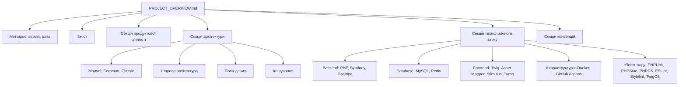
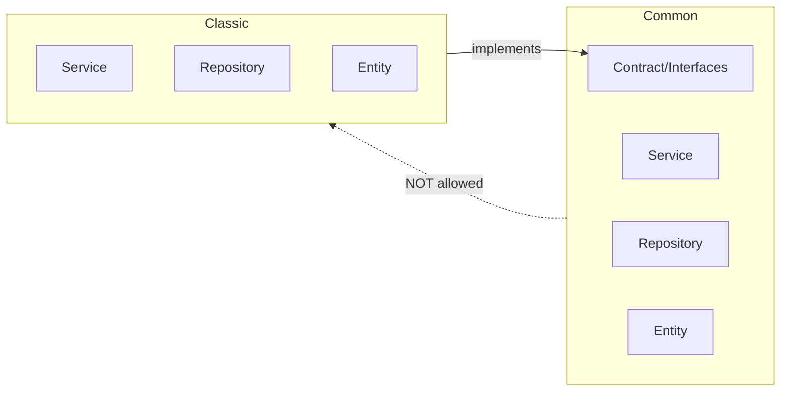
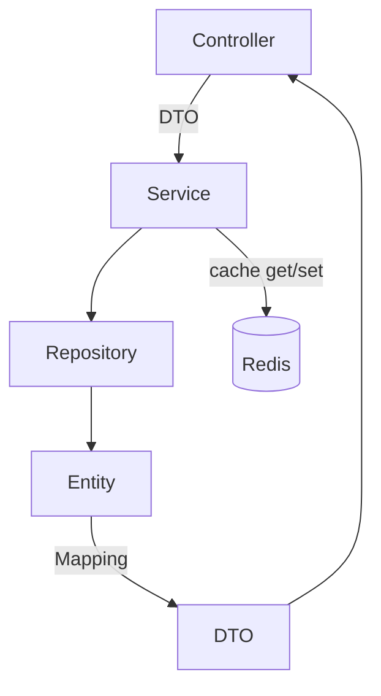

# Дизайн-документ: Проєктна документація

## Огляд

Цей дизайн описує створення єдиного Markdown-документа `docs/PROJECT_OVERVIEW.md`, який забезпечує повне уявлення про проєкт для нових розробників та стейкхолдерів. Документ охоплює продуктову цінність, архітектуру, технологічний стек та конвенції розробки системи рейтингу українського «Що? Де? Коли?».

### Дизайн-рішення

1. **Єдиний файл замість набору документів** — зменшує когнітивне навантаження та спрощує навігацію. Один документ із змістом дає цілісну картину за одне прочитання.
2. **Mermaid-діаграми** — вбудовані діаграми рендеряться на GitHub без зовнішніх залежностей.
3. **Посилання на steering-файл** — секція конвенцій не дублює повний зміст `.kiro/steering/context.md`, а подає стислий огляд із посиланням на авторитетне джерело.
4. **Метадані у заголовку** — дата оновлення та версія документа дозволяють відстежувати актуальність.

## Архітектура

Артефакт — статичний Markdown-файл. Архітектура рішення мінімальна:

```
docs/
└── PROJECT_OVERVIEW.md    ← єдиний артефакт
```

### Структура документа



## Компоненти та інтерфейси

### Секції документа

| Секція | Відповідає вимозі | Зміст |
|--------|-------------------|-------|
| Метадані | 6 | Версія документа, дата оновлення |
| Зміст (TOC) | 1.2 | Посилання на секції та підсекції |
| Продуктова цінність | 2 | Призначення, аудиторія, проблема, можливості, контекст |
| Архітектура | 3 | Модулі, шари, потік даних, кешування |
| Технологічний стек | 4 | Мова, фреймворк, БД, інфраструктура, інструменти |
| Конвенції | 5 | Архітектурні принципи, стиль, безпека, тести, кешування |

### Формат метаданих

Заголовок документа містить:

```markdown
# Огляд проєкту: Рейтинг «Що? Де? Коли?»

> **Версія документа:** 1.0  
> **Останнє оновлення:** YYYY-MM-DD
```

### Структура змісту

Зміст генерується вручну з Markdown-посиланнями:

```markdown
## Зміст

- [Продуктова цінність](#продуктова-цінність)
  - [Призначення](#призначення)
  - [Цільова аудиторія](#цільова-аудиторія)
  - [Ключові можливості](#ключові-можливості)
- [Архітектура](#архітектура)
  - [Модулі](#модулі)
  - [Шарова архітектура](#шарова-архітектура)
  - [Потік даних](#потік-даних)
  - [Кешування](#кешування)
- [Технологічний стек](#технологічний-стек)
  - [Backend](#backend)
  - ...
- [Конвенції розробки](#конвенції-розробки)
  - ...
```

### Секція продуктової цінності — зміст

1. **Призначення** — рейтингова система для інтелектуальних ігор «Що? Де? Коли?» в Україні.
2. **Цільова аудиторія** — гравці, капітани команд, організатори турнірів, організатори майданчиків.
3. **Проблема** — відсутність єдиної платформи для ведення рейтингу команд та гравців.
4. **Ключові можливості** — управління турнірами, командами, гравцями, майданчиками, апеляціями, спірними.
5. **Контекст** — Україна, українська мова, часова зона `Europe/Kyiv`.

### Секція архітектури — зміст

1. **Модулі** — діаграма взаємозв'язків Common ↔ Classic (через інтерфейси).
2. **Common** — загальний код: автентифікація, базові сутності, валідація, хелпери, спільні DTO.
3. **Classic** — специфічна логіка гри: турніри, результати, рейтинги, апеляції.
4. **Правило залежностей** — Common НЕ посилається на Classic; взаємодія лише через інтерфейси (`src/Common/Contract/`).
5. **Шарова архітектура** — Controller → Service → Repository → Entity; DTO + Mapping для передачі даних.
6. **Потік даних** — Controller приймає DTO → Service виконує логіку → Repository працює з БД → Entity маппиться на DTO для відповіді.
7. **Кешування** — Redis із tag-based інвалідацією, кешування DTO, каскадна інвалідація.

Mermaid-діаграма модулів:



Mermaid-діаграма шарів:



### Секція технологічного стеку — зміст

| Категорія | Технологія | Версія |
|-----------|-----------|--------|
| Мова | PHP | 8.5+ |
| Фреймворк | Symfony | 8.0 |
| ORM | Doctrine ORM | 3.x |
| Міграції | Doctrine Migrations | 4.x |
| Шаблонізатор | Twig | 3.x |
| БД | MySQL | 9.3 |
| Кеш | Redis | 7 |
| Контейнеризація | Docker, Docker Compose | — |
| Frontend | Asset Mapper, Stimulus, Turbo | — |
| Автентифікація | Google OAuth2 (league/oauth2-google) | — |
| CI/CD | GitHub Actions | — |
| Якість коду | PHPUnit, PHPStan (level 6), PHPCS (PSR-12), ESLint, Stylelint, TwigCS Fixer | — |
| Безпека | Roave Security Advisories, Gitleaks, Symfony Security Check | — |
| Тестові дані | Alice (nelmio/alice), Faker | — |
| Email (dev) | Mailpit | — |

### Секція конвенцій — зміст

1. **Архітектурні принципи** — модульність, ізоляція через інтерфейси, DTO замість Entity на front-end, автоматичний мапінг.
2. **Стиль коду PHP** — `strict_types`, іменовані імпорти, PHPDoc з усіма виключеннями, pipe-оператор, коментарі англійською.
3. **Безпека та валідація** — trim вводу, Assert-валідація в DTO, rate-limits, OWASP TOP 10, додатні id.
4. **Тестування** — end-to-end тести контролерів, принципи FIRST, покриття happy/unhappy path, dataProvider.
5. **Робота з БД** — логічне розбиття міграцій, порівняння колекцій замість перезатирання, уникнення N+1.
6. **Кешування** — tag-based інвалідація через `TagAwareCacheInterface`, кешування лише DTO, каскадна інвалідація, очищення при деплої.
7. **Посилання** — `Повний перелік правил: .kiro/steering/context.md`.

## Моделі даних

Документ не потребує моделей даних у класичному розумінні. Артефактом є статичний Markdown-файл без програмної обробки.

**Структура файлової системи:**

```
rating/
├── docs/
│   └── PROJECT_OVERVIEW.md    ← створюваний документ
├── .kiro/
│   └── steering/
│       └── context.md         ← авторитетне джерело конвенцій
└── ...
```

## Обробка помилок

Оскільки артефакт — статичний документ, типова обробка помилок не застосовна. Потенційні проблеми:

| Проблема | Рішення |
|----------|---------|
| Неактуальна інформація | Оновлення версії та дати при кожній зміні |
| Битий зміст (broken links) | Перевірка відповідності якорів заголовкам |
| Невалідний Mermaid | Перевірка рендерингу діаграм на GitHub |
| Розбіжність із steering | Секція конвенцій посилається на файл, а не дублює його |

## Стратегія тестування

Property-based testing НЕ застосовний для цієї задачі, оскільки артефактом є статичний Markdown-документ без програмної логіки. Немає функцій з вхідними/вихідними даними, для яких можна формулювати універсальні властивості.

### Підхід до верифікації

1. **Ручна перевірка структури** — документ містить усі чотири основні секції + метадані + зміст.
2. **Перевірка навігації** — усі посилання в змісті ведуть на існуючі заголовки.
3. **Перевірка Mermaid** — діаграми коректно рендеряться на GitHub.
4. **Перевірка актуальності** — інформація відповідає поточному стану проєкту (composer.json, docker-compose.yml, CI config).
5. **Перевірка мови** — документ написаний українською.
6. **Перевірка повноти** — усі критерії приймання з requirements.md покриті відповідним контентом.

### Критерії готовності

- [ ] Файл `docs/PROJECT_OVERVIEW.md` існує
- [ ] Містить версію та дату оновлення
- [ ] Містить зміст із робочими посиланнями
- [ ] Секція продуктової цінності покриває всі 5 критеріїв вимоги 2
- [ ] Секція архітектури покриває всі 7 критеріїв вимоги 3
- [ ] Секція технологічного стеку покриває всі 11 критеріїв вимоги 4
- [ ] Секція конвенцій покриває всі 7 критеріїв вимоги 5
- [ ] Документ написаний українською
