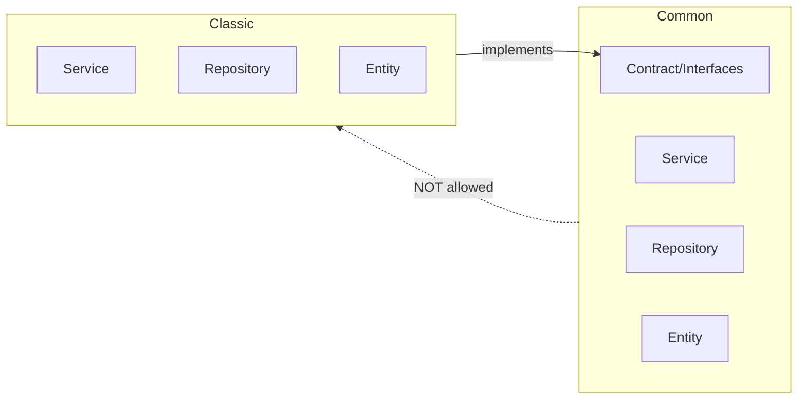
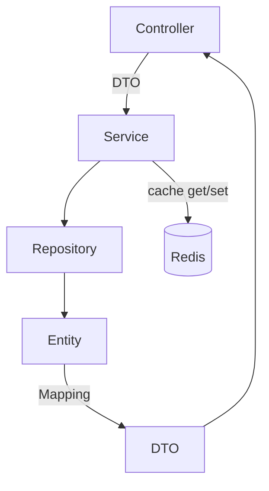

# Огляд проєкту: Рейтинг «Що? Де? Коли?»

> **Версія документа:** 1.0  
> **Останнє оновлення:** 2026-06-28

## Зміст

- [Продуктова цінність](#продуктова-цінність)
  - [Призначення](#призначення)
  - [Цільова аудиторія](#цільова-аудиторія)
  - [Проблема](#проблема)
  - [Ключові можливості](#ключові-можливості)
  - [Контекст](#контекст)
- [Архітектура](#архітектура)
  - [Модулі](#модулі)
  - [Шарова архітектура](#шарова-архітектура)
  - [Потік даних](#потік-даних)
  - [Кешування](#кешування)
- [Технологічний стек](#технологічний-стек)
  - [Backend](#backend)
  - [База даних](#база-даних)
  - [Frontend](#frontend)
  - [Інфраструктура](#інфраструктура)
  - [Автентифікація](#автентифікація)
  - [CI/CD](#cicd)
  - [Якість коду](#якість-коду)
- [Конвенції розробки](#конвенції-розробки)
  - [Архітектурні принципи](#архітектурні-принципи)
  - [Стиль коду PHP](#стиль-коду-php)
  - [Безпека та валідація](#безпека-та-валідація)
  - [Тестування](#тестування)
  - [Робота з базою даних](#робота-з-базою-даних)
  - [Кешування](#кешування-1)

## Продуктова цінність

### Призначення

Система є рейтинговою платформою для інтелектуальних ігор «Що? Де? Коли?» в Україні. Вона забезпечує облік результатів турнірів, розрахунок рейтингів гравців і команд, а також централізоване управління ігровою екосистемою.

### Цільова аудиторія

| Роль | Опис |
|------|------|
| Гравці | Учасники інтелектуальних ігор, які відстежують свій рейтинг та історію виступів |
| Капітани команд | Формують склади команд, реєструють команди на турніри |
| Організатори турнірів | Створюють і проводять турніри, вносять результати, обробляють апеляції |
| Організатори майданчиків | Надають локації для проведення ігор, керують розкладом |

### Проблема

В Україні відсутня єдина платформа для ведення рейтингу команд та гравців українського «Що? Де? Коли?». Результати турнірів розпорошені, немає централізованого обліку виступів, що ускладнює об'єктивне оцінювання рівня гравців і команд.

### Ключові можливості

- **Управління турнірами** — створення, налаштування та проведення турнірів із фіксацією результатів
- **Управління командами** — реєстрація команд, формування складів, історія виступів
- **Управління гравцями** — профілі гравців, індивідуальний рейтинг, статистика
- **Управління майданчиками** — реєстрація локацій для проведення ігор
- **Система апеляцій** — подання та розгляд апеляцій на результати турнірів
- **Обробка спірних ситуацій** — механізм вирішення спірних питань щодо результатів

### Контекст

- **Географія:** Україна
- **Мова інтерфейсу:** українська
- **Часова зона:** `Europe/Kyiv`

## Архітектура

### Модулі

Система складається з двох основних модулів, кожен із яких має чітко визначену відповідальність:

**Common** — модуль загального коду, який містить:

- Автентифікацію (Google OAuth2, управління сесіями)
- Базові сутності (користувачі, ролі, дозволи)
- Валідацію (спільні Assert-правила, валідатори)
- Хелпери (утиліти, трансформери, форматери)
- Спільні DTO (базові класи для передачі даних між шарами)
- Контракти та інтерфейси (`src/Common/Contract/`) — точки взаємодії з іншими модулями

**Classic** — модуль специфічної логіки гри «Що? Де? Коли?», який містить:

- Турніри (створення, налаштування, проведення, публікація результатів)
- Результати (фіксація виступів команд, розрахунок балів)
- Рейтинги (обчислення індивідуальних та командних рейтингів)
- Апеляції (подання, розгляд, вирішення спірних ситуацій)

**Правило залежностей:** модуль Common **не може** посилатися на Classic. Взаємодія між модулями відбувається виключно через інтерфейси, визначені у `src/Common/Contract/`. Classic імплементує ці інтерфейси, забезпечуючи ізоляцію та можливість підміни реалізації без зміни загального коду.

### Шарова архітектура

Кожен модуль побудований за шаровою архітектурою з чітким розподілом відповідальностей:

| Шар | Відповідальність |
|-----|-----------------|
| **Controller** | Приймає HTTP-запити, отримує вхідні DTO (через MapRequestPayload/MapQueryString), делегує обробку Service, повертає відповідь із вихідним DTO |
| **Service** | Містить бізнес-логіку, оркеструє виклики до Repository, взаємодіє з кешем, координує операції між сутностями |
| **Repository** | Забезпечує доступ до бази даних через Doctrine ORM, інкапсулює запити (DQL, QueryBuilder) |
| **Entity** | Доменна модель, що відображає структуру таблиці в базі даних. Не передається на front-end напряму |
| **DTO** | Data Transfer Object — об'єкт для передачі даних між шарами та на front-end. Усі параметри іменовані, без покладання на індекси масивів |
| **Mapping** | Автоматичне перетворення Entity ↔ DTO. Контролер ніколи не створює DTO вручну — лише через мапінг |

### Потік даних

Типовий потік обробки запиту проходить через усі шари:

1. **Controller** приймає HTTP-запит і автоматично маппить тіло/параметри на вхідний **DTO** (валідація через Assert-анотації)
2. **Service** отримує DTO, виконує бізнес-логіку, перевіряє кеш (Redis) на наявність результату
3. Якщо кеш порожній — **Repository** виконує запит до бази даних і повертає **Entity**
4. **Entity** маппиться на вихідний **DTO** через автоматичний Mapping
5. **Service** зберігає результат у кеш (за потреби) та повертає DTO контролеру
6. **Controller** формує HTTP-відповідь із вихідним DTO (JSON або передає у Twig-шаблон)

> **Важливо:** Entity ніколи не передається на front-end або в шаблонізатор напряму — лише через DTO.

### Кешування

Система використовує Redis як шар кешування з tag-based інвалідацією:

| Аспект | Опис |
|--------|------|
| **Адаптер** | `cache.adapter.redis_tag_aware` (production), `cache.adapter.array` (тести) |
| **Інтерфейс** | `TagAwareCacheInterface` — дозволяє прив'язувати кеш-записи до тегів |
| **Що кешується** | Лише DTO (ніколи Entity — через detached state та проблеми серіалізації) |
| **TTL** | Встановлюється як страховка — навіть без явної інвалідації дані оновлюються за розумний час |
| **Інвалідація** | Tag-based: зміна сутності інвалідує всі кеш-записи з відповідним тегом |
| **Каскадна інвалідація** | Зміна турніру автоматично чистить кеш пов'язаних гравців і команд |
| **CacheInvalidator** | Складна логіка інвалідації виноситься в окремий сервіс `CacheInvalidator`; проста — виконується на місці |
| **Деплой** | При деплої виконується `cache:pool:clear cache.app` для повного очищення |

**Що кешувати:**
- Дані, які рідко змінюються (опубліковані турніри, довідники)
- Агреговані дані з високим hit rate

**Що НЕ кешувати:**
- Дрібні запити (1–3 записи, прості SELECT по PK)
- Дані з великою кількістю комбінацій параметрів (низький hit rate)

## Технологічний стек

### Backend

| Технологія | Версія | Призначення |
|-----------|--------|-------------|
| PHP | 8.5+ | Основна мова програмування |
| Symfony | 8.0 | Веб-фреймворк |
| Doctrine ORM | 3.x | Об'єктно-реляційне відображення (ORM) |
| Doctrine Migrations | 4.x | Управління міграціями бази даних |
| Twig | 3.x | Шаблонізатор для рендерингу сторінок |

### База даних

| Технологія | Версія | Призначення |
|-----------|--------|-------------|
| MySQL | 9.3 | Основна реляційна база даних |
| Redis | 7 | Кешування (tag-based інвалідація через `TagAwareCacheInterface`) |

### Frontend

| Технологія | Призначення |
|-----------|-------------|
| Asset Mapper | Управління JavaScript та CSS без збирача (bundler) |
| Stimulus | JavaScript-фреймворк для інтерактивних компонентів |
| Turbo | Прискорення навігації без повного перезавантаження сторінки |

### Інфраструктура

| Технологія | Призначення |
|-----------|-------------|
| Docker | Контейнеризація середовища розробки |
| Docker Compose | Оркестрація контейнерів (PHP, MySQL, Redis, Mailpit) |

### Автентифікація

| Технологія | Призначення |
|-----------|-------------|
| Google OAuth2 | Автентифікація користувачів через Google-акаунт (`league/oauth2-google`) |

### CI/CD

| Технологія | Призначення |
|-----------|-------------|
| GitHub Actions | Автоматизація тестування, лінтингу та деплою |

### Якість коду

| Технологія | Призначення |
|-----------|-------------|
| PHPUnit | Модульне та end-to-end тестування |
| PHPStan (level 6) | Статичний аналіз PHP-коду |
| PHPCS (PSR-12) | Перевірка стилю коду PHP |
| ESLint | Лінтинг JavaScript |
| Stylelint | Лінтинг CSS/SCSS |
| TwigCS Fixer | Перевірка та форматування Twig-шаблонів |

## Конвенції розробки

### Архітектурні принципи

- **Модульність** — система поділена на незалежні модулі (Common, Classic) з чітко визначеними межами
- **Ізоляція через інтерфейси** — модулі взаємодіють виключно через контракти (`src/Common/Contract/`), а не через прямі залежності
- **DTO замість Entity** — на front-end (і в шаблонізатор) передаються лише DTO з іменованими параметрами, ніколи Entity чи масиви
- **Автоматичний мапінг** — DTO створюються через мапінг, а не вручну в контролерах

### Стиль коду PHP

- `declare(strict_types=1)` у кожному файлі
- Іменовані імпорти (без `\`-префіксу); виключення з не-core PHP імпортувати з аліасом
- PHPDoc у кілька рядків із переліком усіх виключень (в алфавітному порядку)
- Pipe-оператор там, де він покращує читабельність
- Коментарі у коді — англійською

### Безпека та валідація

- `trim` усього користувацького вводу та очищення від потенційно небезпечного вмісту
- Assert-валідація безпосередньо в DTO
- Rate-limits на контролерах
- Врахування ризиків OWASP TOP 10
- Integer id мають бути додатними

### Тестування

- End-to-end тести контролерів (по тестовому класу на контролер)
- Принципи FIRST (Fast, Isolated, Repeatable, Self-validating, Timely)
- Покриття всіх happy path та максимальної кількості unhappy path
- Використання `dataProvider` замість дублювання тестів

### Робота з базою даних

- Міграції логічно розбиті на кілька рядків; ALTER однієї таблиці — в один запит
- Оновлення колекцій через порівняння (видалення неактуальних + додавання нових), а не повне перезатирання
- Уникнення проблеми N+1 запитів

### Кешування

- Tag-based інвалідація через `TagAwareCacheInterface` (бекенд — `cache.adapter.redis_tag_aware`)
- Кешування лише DTO, ніколи Doctrine Entity
- Каскадна інвалідація: зміна сутності чистить кеш пов'язаних даних
- Очищення Redis при деплої: `cache:pool:clear cache.app`

---

> **Повний перелік правил:** [`.kiro/steering/context.md`](../.kiro/steering/context.md)
